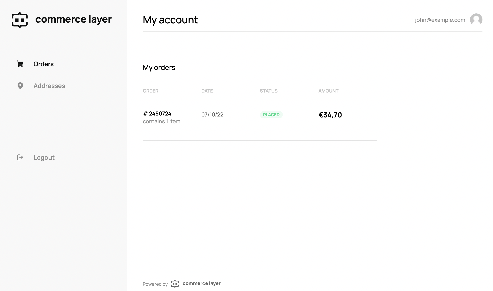

# Commerce Layer My Account

The Commerce Layer My Account application (React) provides you with a production-ready reserved area dedicated to orders detailed history and addresses management, powered by Commerce Layer APIs. You can fork this repository and deploy it to any hosting service or use it as a reference application to build your own. A hosted version is also available.



## What is Commerce Layer?

[Commerce Layer](https://commercelayer.io) is a multi-market commerce API and order management system that lets you add global shopping capabilities to any website, mobile app, chatbot, wearable, voice, or IoT device, with ease. Compose your stack with the best-of-breed tools you already mastered and love. Make any experience shoppable, anywhere, through a blazing-fast, enterprise-grade, and secure API.

## Table of contents

- [Getting started](#getting-started)
- [Hosted version](#hosted-version)
- [Contributors guide](#contributors-guide)
- [Help and support](#need-help)
- [License](#license)

---

## Getting started

1. Create your organization and get your credentials by following one of our [onboarding tutorials](https://docs.commercelayer.io/developers/welcome).

2. Set on your hosting provider the required environment variables `NODE_ENV`, `NEXT_PUBLIC_BASE_PATH`, `NEXT_PUBLIC_DOMAIN` and `NEXT_PUBLIC_HOSTED` using default values found in `.env.local.example` file and be sure to build the forked repository using the node environment (`NODE_ENV`) as production.

3. Deploy the forked repository to your preferred hosting service or host it yourself. You can deploy with one click below:

[](https://app.netlify.com/start/deploy?repository=https://github.com/commercelayer/commercelayer-my-account) [](https://vercel.com/new/clone?repository-url=https://github.com/commercelayer/commercelayer-my-account) [](https://heroku.com/deploy?template=https://github.com/commercelayer/commercelayer-my-account) [](https://cloud.digitalocean.com/apps/new?repo=https://github.com/commercelayer/commercelayer-my-account/tree/main)

4. Build your sales channel with your favorite technologies and frameworks by leveraging our [developer resources](https://commercelayer.io/developers) and [documentation](https://docs.commercelayer.io/api).

5. Get a [customer access token](https://docs.commercelayer.io/core/authentication/password) for your application. You should generate this in your sales channel or use our Javascript [authentication library](https://github.com/commercelayer/commercelayer-js-auth).

6. View my account related to the customer contained in the created accessToken using the URL format: `<your-deployed-my-account-url>/<my-account-base-path>?accessToken=<your-access-token>`.

### Example

`https://myaccount.yourbrand.com/?accessToken=eyJhbGciOiJIUzUxMiJ9`

## Hosted version

Any Commerce Layer account comes with a hosted version of the My Account application that is automatically enabled. You can customize it by adding your organization logo, favicon and primary color.

You can use the hosted version of the My Account application with the following URL format: `https://<your-organization-subdomain>.commercelayer.app/my-account/?accessToken=<your-access-token>`

### Example

`https://yourbrand.commercelayer.app/my-account?accessToken=eyJhbGciOiJIUzUxMiJ9`

## Contributors guide

1. Fork [this repository](https://github.com/commercelayer/commercelayer-my-account) (you can learn how to do this [here](https://help.github.com/articles/fork-a-repo)).

2. Clone the forked repository like so:

```bash
git clone https://github.com/<your username>/commercelayer-my-account.git && cd commercelayer-my-account
```

3. First, install dependencies and run the development server:

```
pnpm install
pnpm dev
```

4. (Optional) Set your environment with `.env.local` starting from `.env.local.sample`.

5. Open [http://localhost:3000](http://localhost:3000) with your browser to see the result. You can use the following format to open the my account: `http://localhost:3000/myaccount?accessToken=<your-access-token>`

6. Make your changes and create a pull request ([learn how to do this](https://docs.github.com/en/github/collaborating-with-issues-and-pull-requests/creating-a-pull-request)).

7. Someone will attend to your pull request and provide some feedback.

## Need help?

1. Join [Commerce Layer's Slack community](https://slack.commercelayer.app).

2. Create an [issue](https://github.com/commercelayer/commercelayer-my-account/issues) in this repository.

3. Ping us [on Twitter](https://twitter.com/commercelayer).

## License

This repository is published under the [MIT](LICENSE) license.
